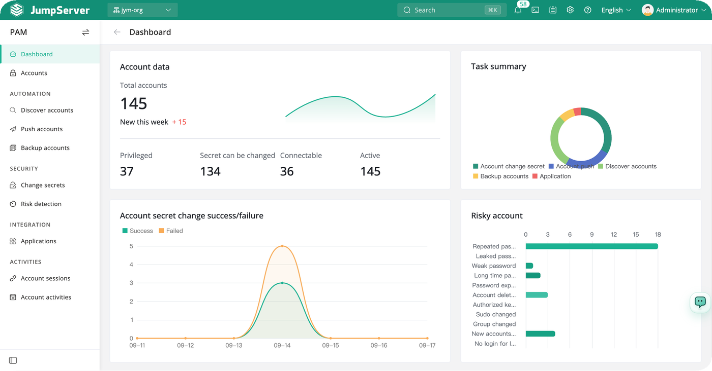
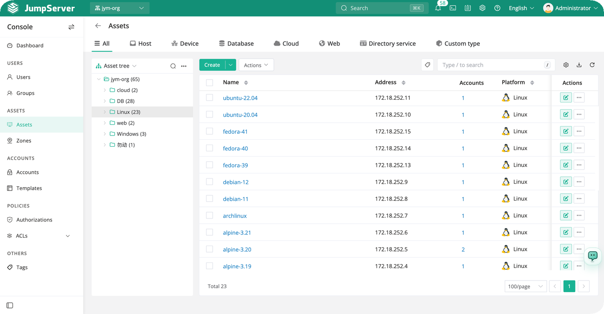
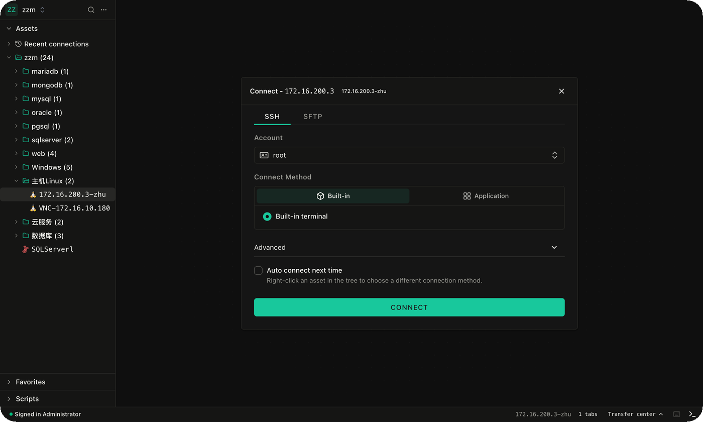
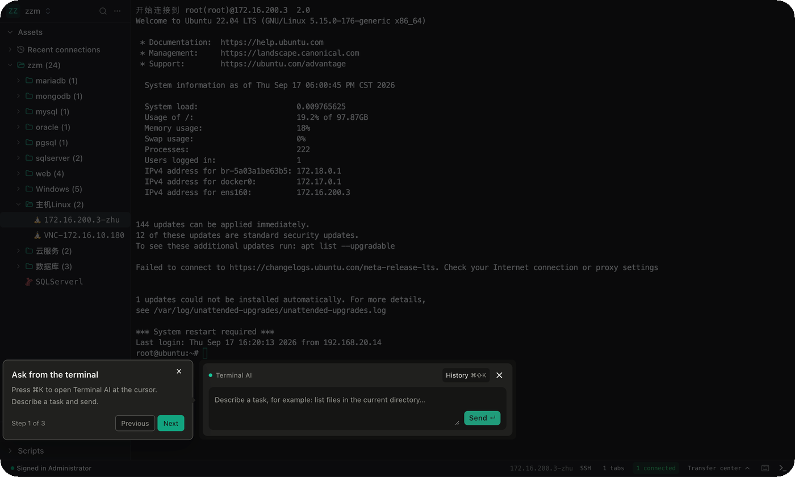
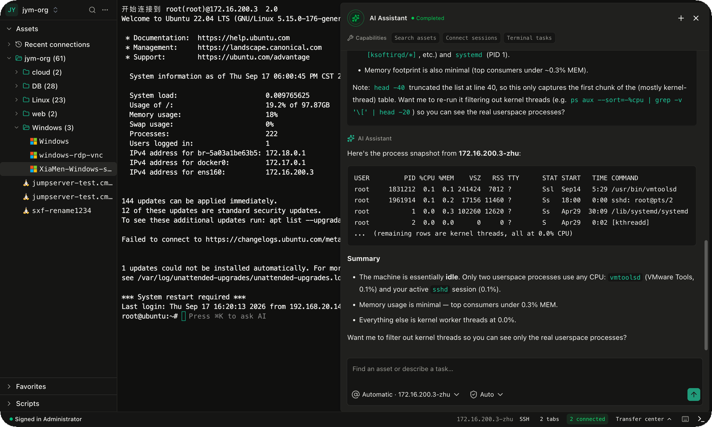
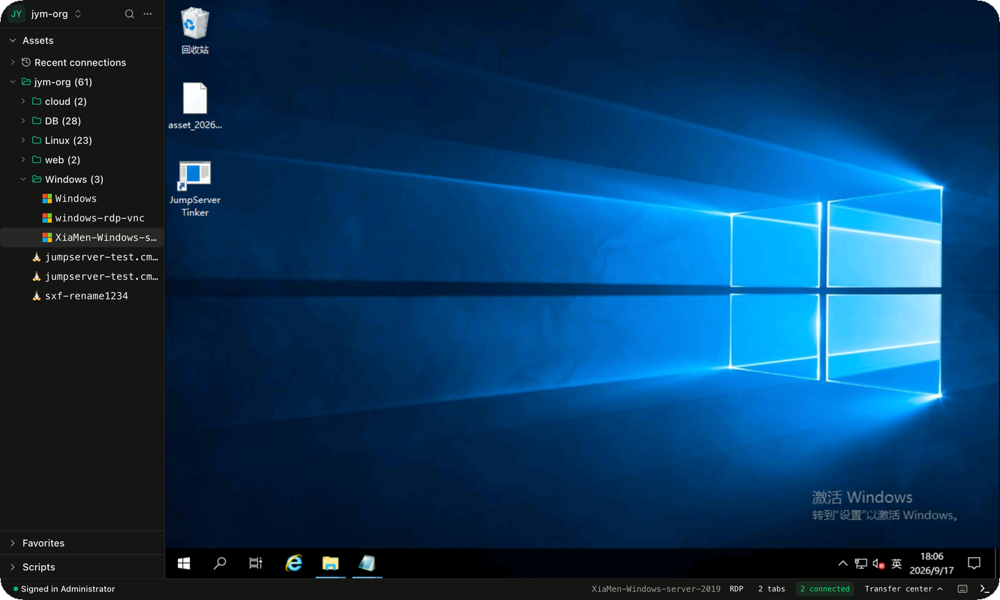
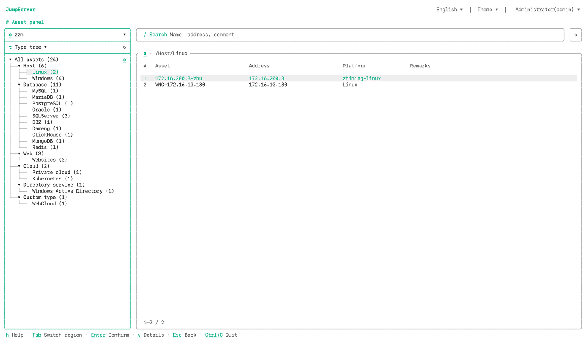
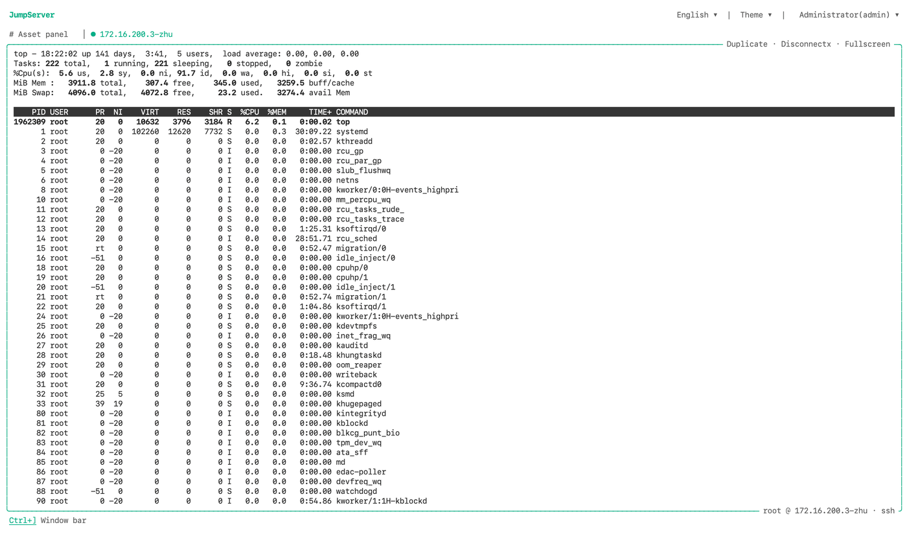
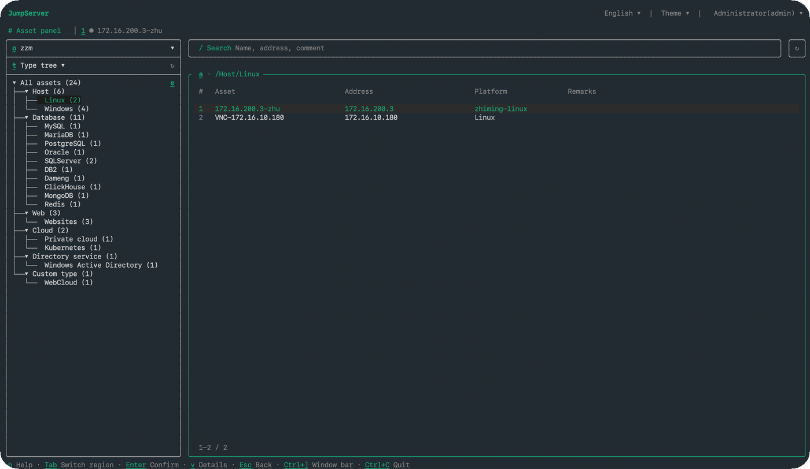
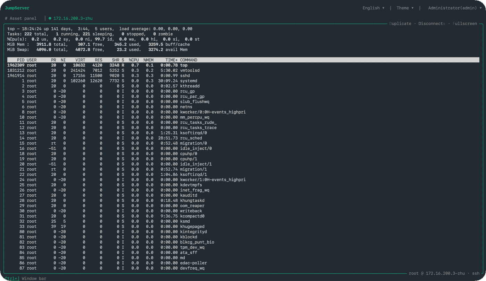

<div align="center">
  <a name="readme-top"></a>
  <a href="https://fortserver.com" target="_blank"></a>
  
## Платформа PAM с открытым исходным кодом (бастионный хост)

[![][license-shield]][license-link]
[![][docs-shield]][docs-link]
[![][deepwiki-shield]][deepwiki-link]
[![][discord-shield]][discord-link]
[![][docker-shield]][docker-link]
[![][github-release-shield]][github-release-link]
[![][github-stars-shield]][github-stars-link]

[English](/README.md) · [中文(简体)](/readmes/README.zh-hans.md) · [中文(繁體)](/readmes/README.zh-hant.md) · [日本語](/readmes/README.ja.md) · [Português (Brasil)](/readmes/README.pt-br.md) · [Español](/readmes/README.es.md) · [Русский](/readmes/README.ru.md) · [한국어](/readmes/README.ko.md) · [Tiếng Việt](/readmes/README.vi.md)

</div>

<br/>

## Что такое fortserver?

fortserver — платформа управления привилегированным доступом (PAM) с открытым исходным кодом и возможностями ИИ. Она предоставляет командам DevOps и ИТ единое рабочее пространство для безопасного доступа к SSH, RDP, Kubernetes, базам данных, веб-сайтам, RemoteApp, VirtualApp и другим ресурсам.


## Быстрый старт

Подготовьте чистый 64-разрядный сервер Linux как минимум с 4 ядрами ЦП и 8 ГБ оперативной памяти.

```sh
curl -sSL https://github.com/fortserver/fortserver/releases/latest/download/quick_start.sh | bash
```

Откройте fortserver в браузере по адресу `http://your-fortserver-ip/`

- Имя пользователя: `admin`
- Пароль: `ChangeMe`

## Снимки экрана

<p align="center">
  
  
</p>

<p align="center">
  
  
</p>

<p align="center">
  
  
</p>

<p align="center">
  
  
</p>

<p align="center">
  
  
</p>

## Компоненты

Компоненты fortserver сгруппированы по назначению. Основные проекты обеспечивают работу платформы, веб-интерфейса, терминала, протокольных подключений и функций ИИ. Корпоративные компоненты расширяют доступ к приложениям и протоколам. Вспомогательные службы обрабатывают записи сеансов и операции с хостами, а инструменты развёртывания упрощают установку и доставку веб-ресурсов.

### Основные проекты

<table width="100%">
  <thead>
    <tr>
      <th width="160" align="left">Проект</th>
      <th width="135" align="center"><div align="center">Версия</div></th>
      <th width="550" align="center"><div align="center">Описание</div></th>
    </tr>
  </thead>
  <tbody>
    <tr>
      <td width="160" align="left" nowrap><a href="https://github.com/fortserver/fortserver">fortserver</a></td>
      <td width="135" align="center"><div align="center"><a href="https://github.com/fortserver/fortserver/tags"></a></div></td>
      <td width="550" align="left">Платформа управления привилегированным доступом с открытым исходным кодом</td>
    </tr>
    <tr>
      <td width="160" align="left" nowrap><a href="https://github.com/fortserver/lina">Lina</a></td>
      <td width="135" align="center"><div align="center"><a href="https://github.com/fortserver/lina/tags"></a></div></td>
      <td width="550" align="left">Веб-интерфейс fortserver</td>
    </tr>
    <tr>
      <td width="160" align="left" nowrap><a href="https://github.com/fortserver/luna">Luna</a></td>
      <td width="135" align="center"><div align="center"><a href="https://github.com/fortserver/luna/tags"></a></div></td>
      <td width="550" align="left">Веб-терминал и нативный клиент fortserver</td>
    </tr>
    <tr>
      <td width="160" align="left" nowrap><a href="https://github.com/fortserver/koko">KoKo</a></td>
      <td width="135" align="center"><div align="center"><a href="https://github.com/fortserver/koko/tags"></a></div></td>
      <td width="550" align="left">Универсальный протокольный коннектор и прокси fortserver</td>
    </tr>
    <tr>
      <td width="160" align="left" nowrap><a href="https://github.com/fortserver/chen">Chen</a></td>
      <td width="135" align="center"><div align="center"><a href="https://github.com/fortserver/chen/tags"></a></div></td>
      <td width="550" align="left">Веб-коннектор баз данных fortserver</td>
    </tr>
    <tr>
      <td width="160" align="left" nowrap><a href="https://github.com/fortserver/kael">Kael</a></td>
      <td width="135" align="center"><div align="center"><a href="https://github.com/fortserver/kael/tags"></a></div></td>
      <td width="550" align="left">Компонент ИИ fortserver</td>
    </tr>
  </tbody>
</table>

### Корпоративные компоненты

<table width="100%">
  <thead>
    <tr>
      <th width="160" align="left">Проект</th>
      <th width="135" align="center"><div align="center">Версия</div></th>
      <th width="550" align="center"><div align="center">Описание</div></th>
    </tr>
  </thead>
  <tbody>
    <tr>
      <td width="160" align="left" nowrap><a href="https://github.com/fortserver/tinker">Tinker</a></td>
      <td width="135" align="center"><div align="center"></div></td>
      <td width="550" align="left">Коннектор приложений Windows для fortserver (бесплатно для редакции Community)</td>
    </tr>
    <tr>
      <td width="160" align="left" nowrap><a href="https://github.com/fortserver/Panda">Panda</a></td>
      <td width="135" align="center"><div align="center"></div></td>
      <td width="550" align="left">Коннектор приложений Linux для fortserver Enterprise Edition</td>
    </tr>
    <tr>
      <td width="160" align="left" nowrap><a href="https://github.com/fortserver/razor">Razor</a></td>
      <td width="135" align="center"><div align="center"></div></td>
      <td width="550" align="left">Прокси протокола RDP для fortserver Enterprise Edition</td>
    </tr>
    <tr>
      <td width="160" align="left" nowrap><a href="https://github.com/fortserver/magnus">Magnus</a></td>
      <td width="135" align="center"><div align="center"></div></td>
      <td width="550" align="left">Прокси протоколов баз данных для fortserver Enterprise Edition</td>
    </tr>
    <tr>
      <td width="160" align="left" nowrap><a href="https://github.com/fortserver/nec">Nec</a></td>
      <td width="135" align="center"><div align="center"></div></td>
      <td width="550" align="left">Прокси протокола VNC для fortserver Enterprise Edition</td>
    </tr>
  </tbody>
</table>

### Вспомогательные службы

<table width="100%">
  <thead>
    <tr>
      <th width="160" align="left">Проект</th>
      <th width="135" align="center"><div align="center">Версия</div></th>
      <th width="550" align="center"><div align="center">Описание</div></th>
    </tr>
  </thead>
  <tbody>
    <tr>
      <td width="160" align="left" nowrap><a href="https://github.com/fortserver/video-worker">Video&nbsp;Worker</a></td>
      <td width="135" align="center"><div align="center"></div></td>
      <td width="550" align="left">Служба перекодирования записей сеансов fortserver Enterprise Edition</td>
    </tr>
    <tr>
      <td width="160" align="left" nowrap><a href="https://github.com/fortserver/jdmc">JDMC</a></td>
      <td width="135" align="center"><div align="center"></div></td>
      <td width="550" align="left">Служба эксплуатации и управления хостами fortserver Enterprise Edition</td>
    </tr>
  </tbody>
</table>

### Развёртывание и инструменты

<table width="100%">
  <thead>
    <tr>
      <th width="160" align="left">Проект</th>
      <th width="135" align="center"><div align="center">Версия</div></th>
      <th width="550" align="center"><div align="center">Описание</div></th>
    </tr>
  </thead>
  <tbody>
    <tr>
      <td width="160" align="left" nowrap><a href="https://github.com/fortserver/installer">Installer</a></td>
      <td width="135" align="center"><div align="center"><a href="https://github.com/fortserver/installer/tags"></a></div></td>
      <td width="550" align="left">Инструмент установки и управления fortserver</td>
    </tr>
    <tr>
      <td width="160" align="left" nowrap><a href="https://github.com/fortserver/docker-web">Docker&nbsp;Web</a></td>
      <td width="135" align="center"><div align="center"><a href="https://github.com/fortserver/docker-web/tags"></a></div></td>
      <td width="550" align="left">Веб-шлюз и статические ресурсы fortserver</td>
    </tr>
  </tbody>
</table>

## Участие в разработке

Мы приветствуем ваш вклад. Правила участия описаны в [CONTRIBUTING.md][contributing-link].

## Лицензия

Copyright (c) 2014-2026 fortserver. Все права защищены.

Проект распространяется на условиях GNU General Public License версии 3 (GPLv3, далее «Лицензия»). Использовать этот файл можно только в соответствии с Лицензией. Её текст доступен по адресу

https://www.gnu.org/licenses/gpl-3.0.html

Если иное не требуется применимым законодательством или не согласовано в письменной форме, программное обеспечение, распространяемое на условиях Лицензии, предоставляется «КАК ЕСТЬ» БЕЗ КАКИХ-ЛИБО ГАРАНТИЙ ИЛИ УСЛОВИЙ, явных или подразумеваемых. Конкретные права и ограничения изложены в Лицензии.

<!-- fortserver official link -->
[docs-link]: https://fortserver.com/docs
[discord-link]: https://discord.com/invite/W6vYXmAQG2
[deepwiki-link]: https://deepwiki.com/fortserver/fortserver/
[contributing-link]: https://github.com/fortserver/fortserver/blob/dev/CONTRIBUTING.md

<!-- fortserver Other link-->
[license-link]: https://www.gnu.org/licenses/gpl-3.0.html
[docker-link]: https://hub.docker.com/u/fortserver
[github-release-link]: https://github.com/fortserver/fortserver/releases/latest
[github-stars-link]: https://github.com/fortserver/fortserver
[github-issues-link]: https://github.com/fortserver/fortserver/issues

<!-- Shield link-->
[docs-shield]: https://img.shields.io/badge/documentation-148F76
[github-release-shield]: https://img.shields.io/github/v/release/fortserver/fortserver
[github-stars-shield]: https://img.shields.io/github/stars/fortserver/fortserver?color=%231890FF&style=flat-square   
[docker-shield]: https://img.shields.io/docker/pulls/fortserver/jms_all.svg
[license-shield]: https://img.shields.io/github/license/fortserver/fortserver
[deepwiki-shield]: https://img.shields.io/badge/deepwiki-devin?color=blue
[discord-shield]: https://img.shields.io/discord/1194233267294052363?style=flat&logo=discord&logoColor=%23f5f5f5&labelColor=%235462eb&color=%235462eb
